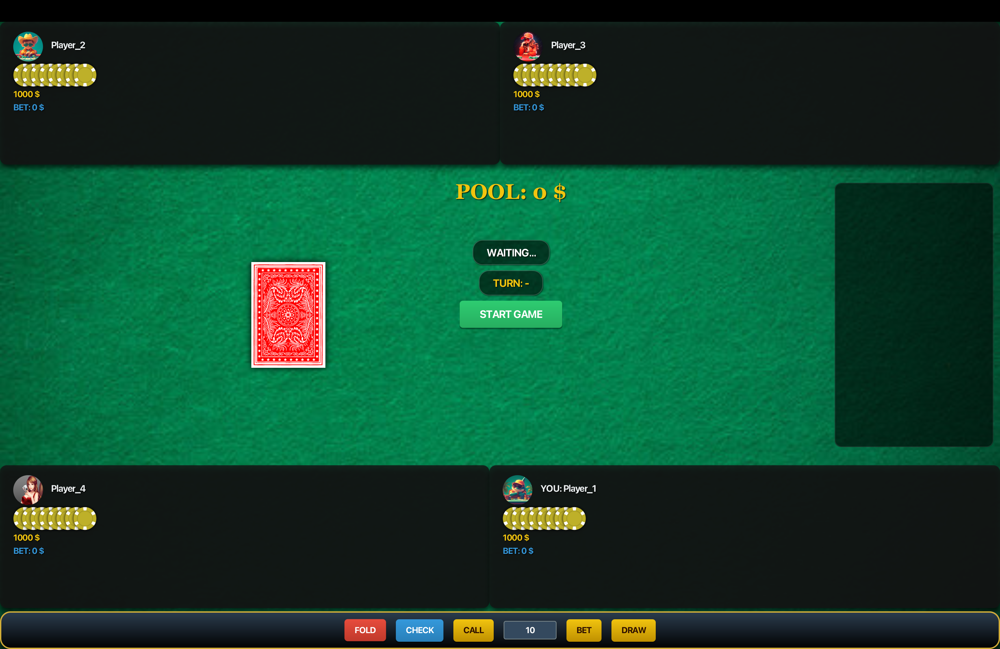
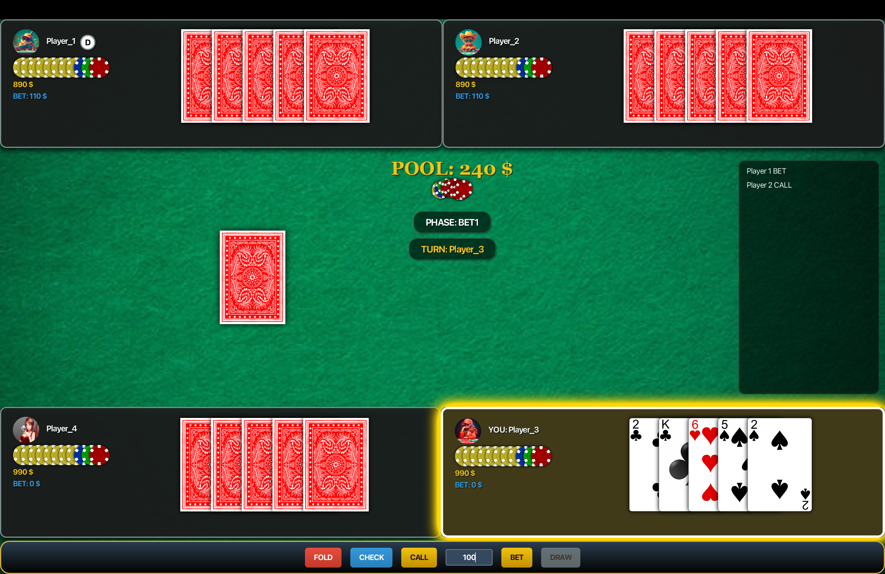
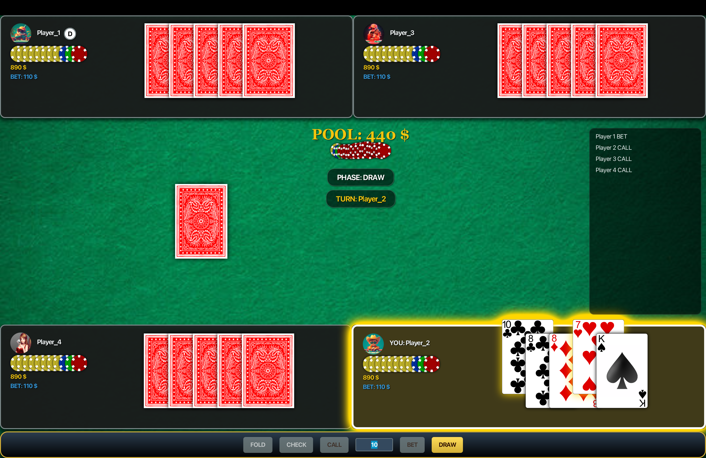
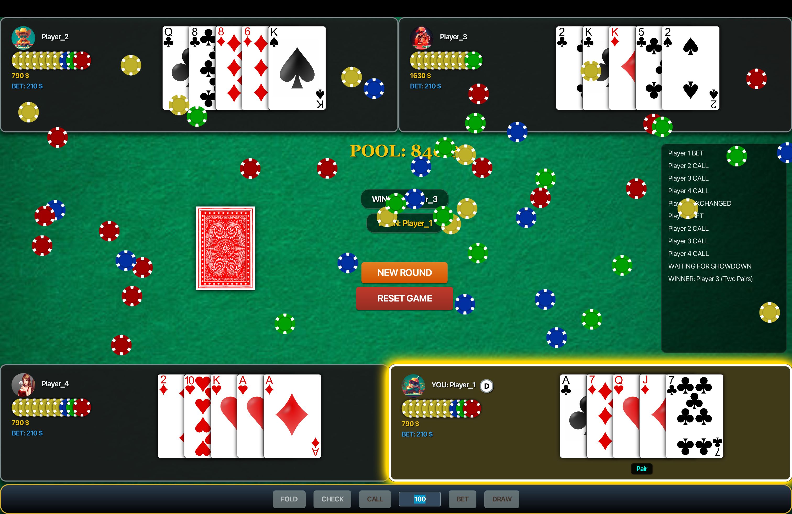

# Professional Poker 5-Card Draw

  

A robust, multiplayer implementation of the classic **5-Card Draw** poker variant. This project features a custom non-blocking I/O (NIO) server, a responsive JavaFX graphical interface with animations, and dynamic room management capable of handling multiple concurrent game tables.

---

## 📸 Gameplay Preview

|                                                       **Lobby & Game Start**                                                        |                                                          **Betting Phase**                                                           |
|:-----------------------------------------------------------------------------------------------------------------------------------:|:------------------------------------------------------------------------------------------------------------------------------------:|
|  *Waiting for players and table allocation.* |  *Visual chip stacks and player actions.* |

| **Card Exchange** | **Showdown & Win** |
|:-------------------------:|:-------------------------:|
|  *Selecting cards to exchange.* |  *Winning hand reveal and chip rain animation.* |

---

## ✨ Key Features

### Core Mechanics
* **5-Card Draw Rules**: Full implementation including Ante, two betting rounds, and a card exchange phase.
* **Dynamic Room Management**: The server automatically manages tables. If a table reaches capacity (4 players), a new room is dynamically created for subsequent players.
* **Dealer Logic**: Rotating Dealer button ('D') that determines the betting order for each round.
* **Hand Evaluation**: Advanced algorithm to detect hand rankings from *High Card* to *Royal Flush*.

### Visual Experience
* **Smooth Animations**:
    * **Card Flip**: Realistic scaling animations when revealing cards.
    * **Visual Pot**: Chip stacks on the table grow dynamically as bets are placed.
    * **Payout**: Animated chips fly from the pot to the winner.
    * **Victory**: "Chip rain" effect upon winning a round.
* **Interactive UI**: Hover effects on buttons, dynamic phase labels, and a scrolling action log.
* **Showdown Tension**: A dramatic pause sequence during the final reveal phase to build suspense before announcing the winner.

### Technical Architecture
* **Multi-module Maven Project**: Clean separation of concerns (`client`, `server`, `model`, `common`).
* **Custom Network Protocol**: Text-based TCP protocol handling game state synchronization and broadcasting.
* **Robust State Machine**: Server-side game engine enforcing rules, turn orders, and betting validation.

---

## 🛠️ Project Structure

The project is divided into four Maven modules:

* `poker-client`: The JavaFX desktop application. Handles rendering, animations, and user input.
* `poker-server`: The core game server. Manages connections, game loops, and table logic using Java NIO.
* `poker-model`: Contains business logic (Deck, Card, HandChecker, GameEngine) and JUnit tests.
* `poker-common`: Shared resources, protocol definitions, and utility parsers.

---

## 🚀 Getting Started

### Prerequisites
* **Java Development Kit (JDK) 17** or higher.
* **Apache Maven** 3.6 or higher.

### Installation
1.  Clone the repository:
    ```bash
    git clone [https://github.com/your-username/poker-5card-draw.git](https://github.com/your-username/poker-5card-draw.git)
    cd poker-javafx
    ```
2.  Build the project:
    ```bash
    mvn clean install
    ```

### Running the Application

#### 1. Start the Server
Navigate to the server module and run the application. The server defaults to port `7777`.
```bash
    cd poker-server
    mvn javafx:run
    # Or run the PokerServerAppMain class directly from your IDE
```
 
 
#### 2. Start the Clients
Open multiple terminal instances (or run multiple instances in your IDE) for the client.
```bash
  cd poker-client
  mvn javafx:run
  # Or run the PokerGuiLauncher class directly from your IDE
```

## 🃏 How to Play

1.  **Joining**: Launch the client. You will be automatically assigned to an open table (max 4 players).
2.  **Ante**: The game begins by collecting a forced bet (Ante) from all players.
3.  **Betting Round 1**: Players act in turn starting from the Dealer. Options: `Bet`, `Call`, `Check`, `Fold`.
4.  **Draw Phase**: Select cards you wish to discard by clicking on them (they will float up). Click **DRAW** to exchange them for new ones.
5.  **Betting Round 2**: A final round of betting based on the new hands.
6.  **Showdown**:
    * The Dealer clicks the **SHOWDOWN** button.
    * Active players' cards are revealed.
    * The system evaluates hands, declares the winner, and awards the pot.

## 📋 Communication Protocol

The client and server communicate via a custom text protocol over TCP. Examples:

### Client -> Server
* `JOIN <gameId>`: Request to join a specific table.
* `BET <amount>`, `FOLD`, `CHECK`, `CALL`: Game actions.
* `DRAW <index1> <index2>`: Request to exchange specific cards.
* `SHOWDOWN`: Dealer requests end of round.

### Server -> Client
* `WELCOME <gameId> <playerId>`: Successful connection.
* `DEAL <cards>`: Private message with player's hand.
* `ACTION <playerId> <move> <amount>`: Broadcast of an opponent's move.
* `WINNER <name> <amount> <hand>`: Announcement of round results.